# OCR_tesseract
- Module using OCR technology

<br/>

## Reason:
- Naver(clova), google(drive) 의 OCR API를 이용하여 공부 할까 했지만
<br> **요금부가 및 지속적인 서비스에 애매**

- clova 대략적인 절차
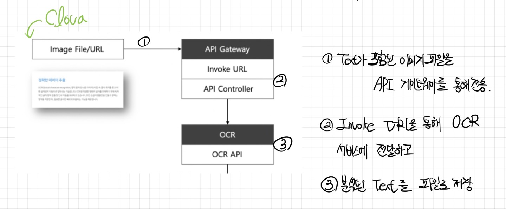

- 따라서, **pytesseract** 이용

<br/>

## What is Tesseract?
- 다양한 운영체제를 위한 광학 문자 인식(OCR) 엔진
  - 쉽게 말해, OCR 오픈소스 라이브러
  - 3대 OCR엔진에 속한다
- 많은 언어 및 스크립트에 대한 LSTM(딥러닝)기반 OCR 엔진 및 모델이 추가되어 총 116개의 언어가 제공된다

<br/>

## Principle
- Tesseract는 input이미지의 특징점을 추출하고 그 특징점을 사용하여 문자를 인식
  - 특징점을 추출하는 방법은 원래의 image에서 outline을 생성한 후
  - 방향성을 정하고
  - 방향성에 따라 다각형에 근접하게 추출하게된다.
  - 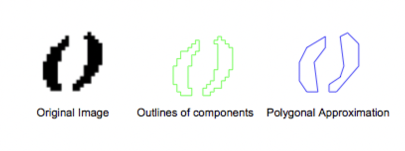

<br/>

- Tesseract OCR은 기본적으로 하위의 1. preprocessor와 2. segmentation 과정을 거쳐 나온 이미지를<br> 신경망 기법과 template matching기법을 사용하여 input 이미지를 인식하고 출력하게 된다.

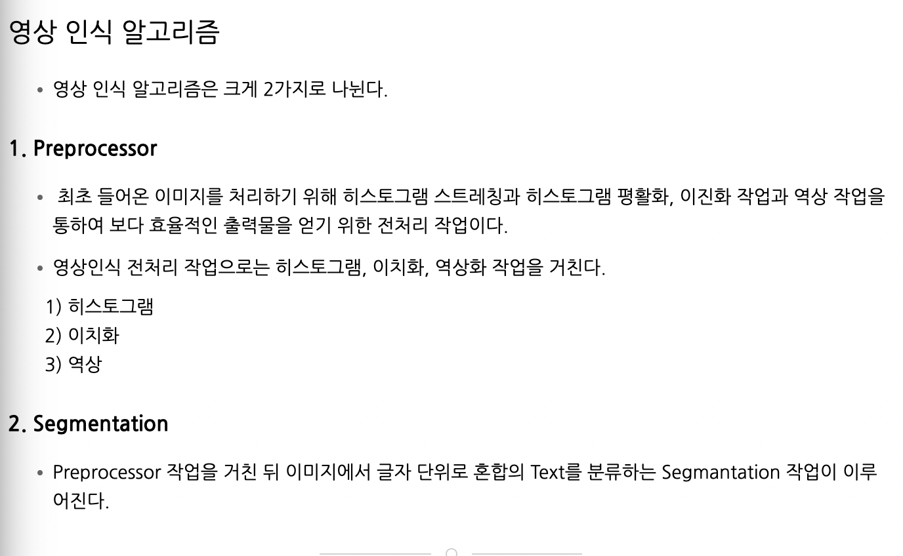

<br/>

  - 문자의 특징점이 추출되면 Tesseract 데이터 베이스 검색을 통하여 특징점이 비슷한 문자들과의 <br>Template Matching을 통해 특징점과 원본 이미지와의 오차율이 가장 낮은 문자를 선택하게 된다
  - 이때, input 이미지의 문자와의 오차율을 Tesseract Template에 저장하여 **Training** 시킴으로써 보다 나은 효율을 증가

  - 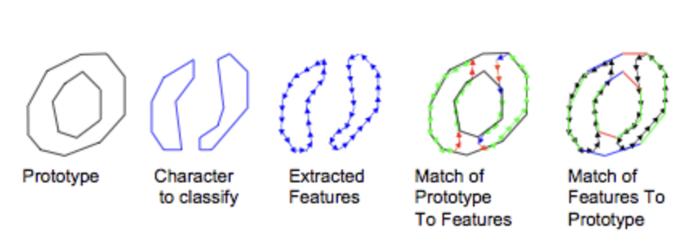

    - **Training**
      - Tesseract는 인식률 향상을 위해서 Training 데이터를 적용할 수 있다
      - 미리 학습시켜놓은 데이터들은 Tesseract 데이터 베이스에 저장되어<br> 나중에 글자와 트레이닝 데이터와 유사율을 비교하여 인식 결과를 반환

## How to use?
- Tesseract Engine 설치
  - python에서 직접 경로 추가
- OpenCV, PyTesseract 설치
  - OCR,이미지 처리를 수행하는데 필요한 필수 python패키지 설치
- Trained Data Download
  - 한글을 인식하는 셈플데이터 `/opt/homebrew/Cellar/tesseract/5.2.0/share/tessdata` 에 저장


### Test1(test_ocr.py, test_ocr2.py)
- 입력된 이미지 전처리과정을 통해 Scan한 이미지로 변경 `plt_imshow`메서드를 통해 이미지 확인
- `Contour`과정을 통해 이미지의 외곽선을 검출<br>(`run_tesseract_ocr`메서드),(`make_scan_image`메서드)
- gray, blurred, edged의 방식으로 Scan이미지로 변경
  - (test_ocr.py, test_ocr2.py) 동일한 내용
- **이미지 연산을 통해 Scan이미지로의 변경보다는 다른 방법 강구**

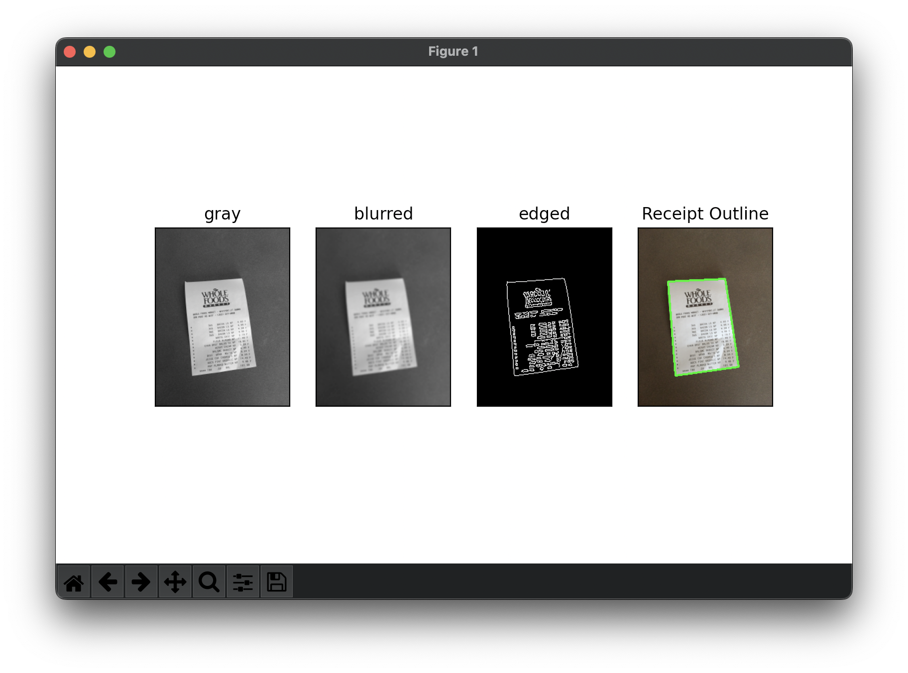

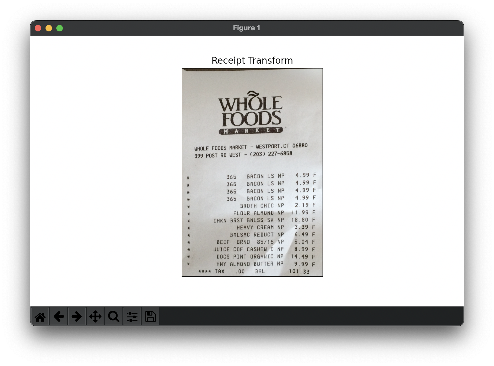
<br/>

### Test2(test_ocr3.py)
- Test1과 유사하지만 실제 영수증에 **Test**
- `make_scan_image`메서드 수정
  - Test1에서 사용한 `plt_imshow`메서드는 계속 사용
  - `make_scan_image`메서드 인자 초깃값으로 `min_threshold=400, max_threshold=400`을 했지만 edged 사용X로 무쓸모
  - edged를 삭제하고 binary를 추가
- contours = 외곽선들의 집합(`cnts`)

- Test 결과
  - 영수증 1
    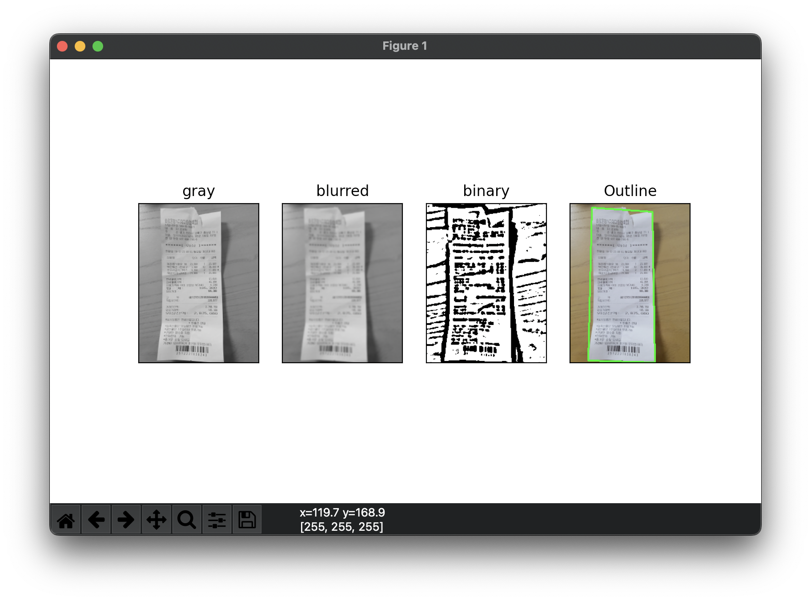

    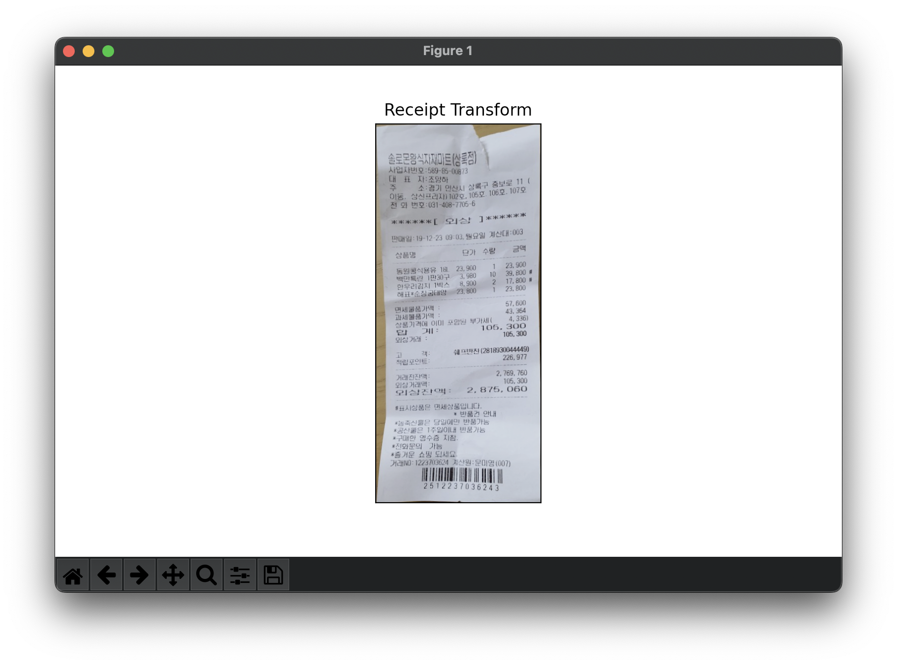
  - 영수증 2
    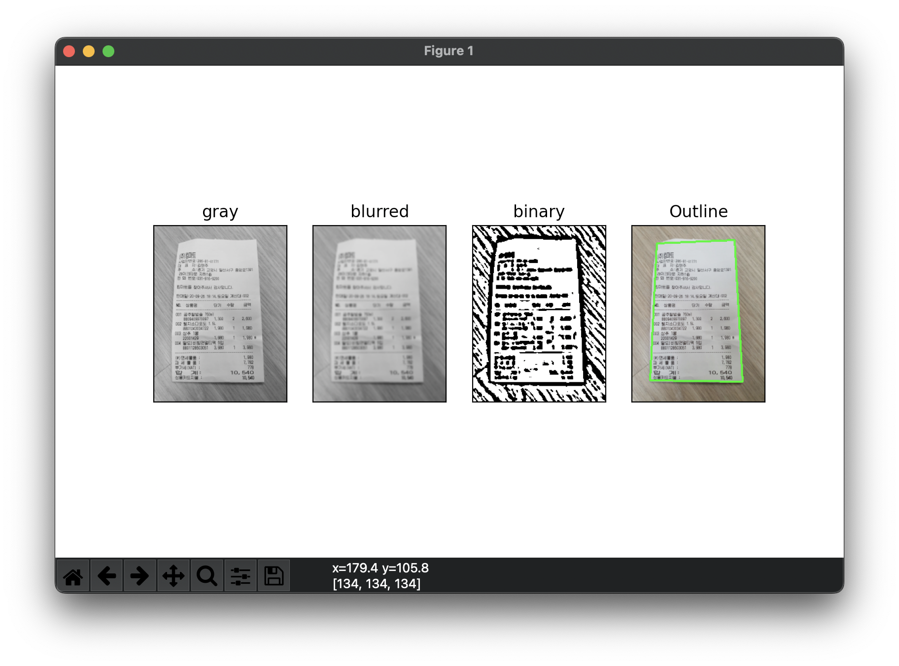

    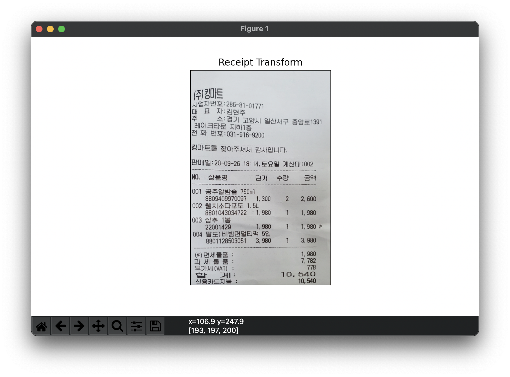
  - 영수증 3
    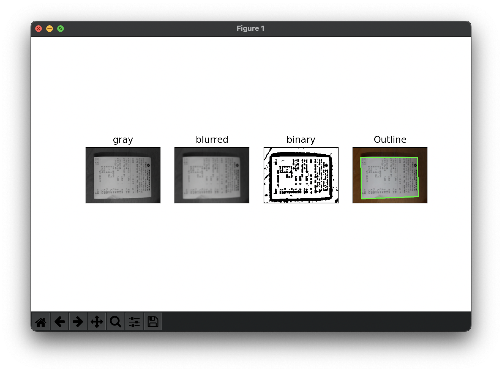

    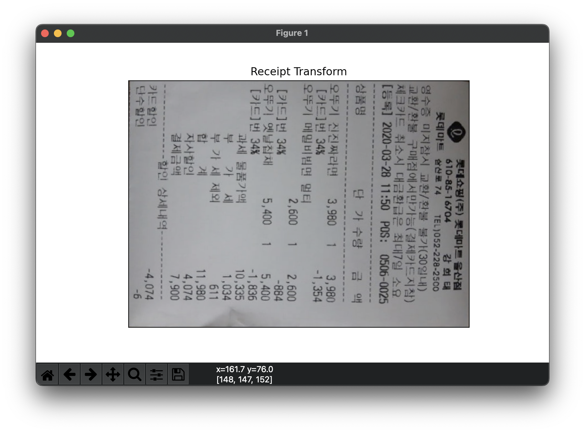


- 💣삽질 및 고생
  - 외곽선이 이어지는 경우와 안이어지는 경우를 나누어 생각했다<br>(+ edged를 놓지 못해서 날린 시간)
    - 각 이미지 변환처리의 임계값 조정 및 조합으로 해결
  - 처음보는 함수와 여러 인자들 때문에 구글링하느라 시간의 80%를 ~허비~ 투자
  - 정작 예제 사진은 인식이 안되고 다른 종류의 영수증이 인식이 된다
  - kor trained data 인식오류?
    - xxx

<br/>


### Test3(test_ocr4.py)
- 원하는 영역만 추출이 목적
- 이미지 처리기술과 OpenCV 라이브러리를 사용하여 입력 이미지에서 원하는 텍스트 추출
  - 이미지 연산을 통한 영역 추출
    - 쉽게 말해 필터링 작업
      - `cv2.getStructuringElement`, `cv2.GaussianBlur`, `cv2.morphologyEx` 등등의 메소드 사용

    - 그레이 스케일로 변환
      - `gray = cv2.cvtColor(receipt, cv2.COLOR_BGR2GRAY)`

    - 흐릿한 Grayscale 이미지에 blackhat 모노폴리 연산을 적용 `cv2.morphologyEx`<br> blackhat연산은 밝은 배경에서 어두운 영역을 드러내기위해 사용 -> 영수증에 효율적
    - 닫힘연산을 통해 끊어져보이는 객체를 연결하여 grouping `cv2.morphologyEx(grad, cv2.MORPH_CLOSE, rectKernel)`
    - Dilation, Erosion 사용으로 이미지 형태 변환

  ``` python
  #원하는 영역 추출로 변환과정
  #grayscale로 변환
  gray = cv2.cvtColor(receipt, cv2.COLOR_BGR2GRAY)
  (H, W) = gray.shape

  # getStructuringElement -> 형태학적 변환 인자로 커널사이즈 조정
  #이미지 필터링과정
  rectKernel = cv2.getStructuringElement(cv2.MORPH_RECT, (15,10))
  sqKernel = cv2.getStructuringElement(cv2.MORPH_RECT, (15, 10))
  gray = cv2.GaussianBlur(gray, ksize, 0)
  blackhat = cv2.morphologyEx(gray, cv2.MORPH_BLACKHAT, rectKernel)
  grad = cv2.Sobel(blackhat, ddepth=cv2.CV_32F, dx=1, dy=0, ksize=-1)
  grad = np.absolute(grad)
  (minVal, maxVal) = (np.min(grad), np.max(grad))
  grad = (grad - minVal) / (maxVal - minVal)
  grad = (grad * 255).astype("uint8")
  #close
  grad = cv2.morphologyEx(grad, cv2.MORPH_CLOSE, rectKernel)
  thresh = cv2.threshold(grad, 0, 255, cv2.THRESH_BINARY | cv2.THRESH_OTSU)[1]
  #close + Dilation(팽창) + Erosion(침식)
  close_thresh = cv2.morphologyEx(thresh, cv2.MORPH_CLOSE, sqKernel)
  close_thresh = cv2.dilate(close_thresh,None, iterations=6)
  close_thresh = cv2.erode(close_thresh, None, iterations=2)
  ```

- Detecion
  - grouping된 영역의 윤곽선을 찾고 그 윤곽선이 특정 조건(ex: 종횡비)에 만족하는 영역만 추출
    
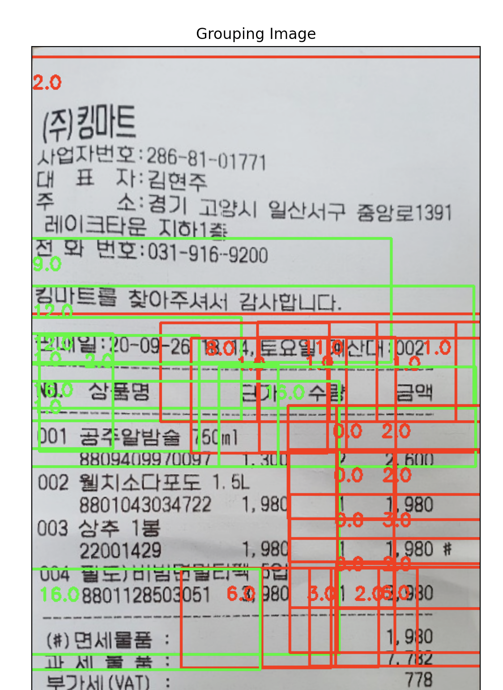

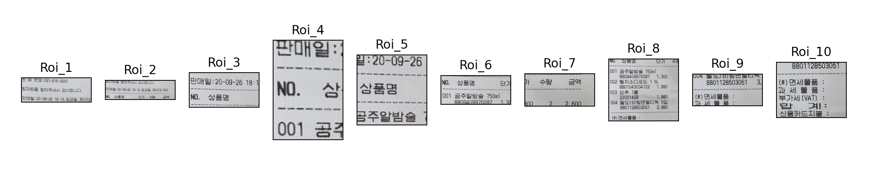

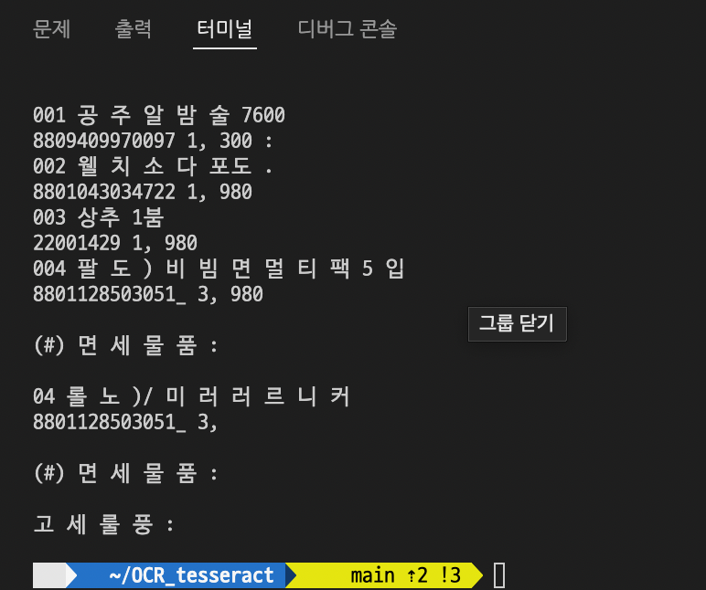


- 💣삽질 및 고생 그리고 **결론...**
  - 영수증에서 특정 부분에 해당하는 영역만 추출하기가 매우 어려움
    - 물품이름이 포함된 `Roi_num`이미지를 구할수는 있지만 모든 `Roi_num`이미지에서 물품이름만 골라 빼내기엔 한계가 있음
    - 우선 한글이 포함되어있는 문자만 출력 
  - 이미지연산에서 인자값 조정으로 많은 시간을 날림
  
  <br/>


## ocr.py
- `plt_show` 와 같이 UI에 뿌려주는 것 +(윤곽생성 절차) 생략
- `make_scan_image`가 모든 작업을 수행 후 text출력  


### 💡결론...

**이미지에서 텍스트를 출력하기 위해선 이미지의 노이즈를 잡기위해 필터링작업(변환작업)을 많이 수행해야하고 적절히 수행해야할 것 같다 <br>그 후, 특정 윤곽을 찾고 특정 영역에 해당하는 부분만을 찾는다는 것은 더 획기적인 이미지 윤곽설정이랑 변환작업이 필요로 할 것 같다**

+ 신분증 인식과 유사하게 상단에 **상품명, 단가** 등을 맞춰서 이미지 인식시 정확도 증가
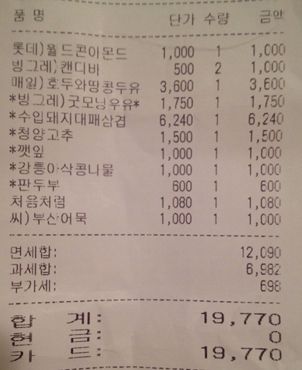

<br/>

  ## Output

  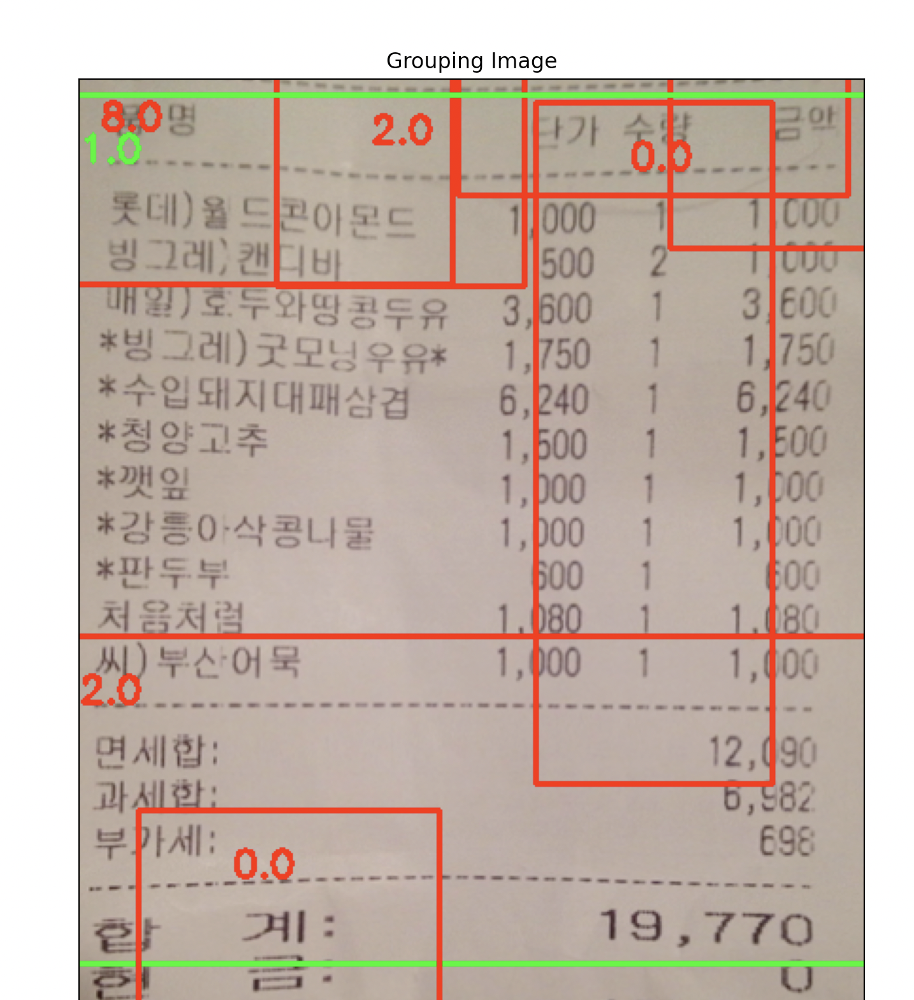

  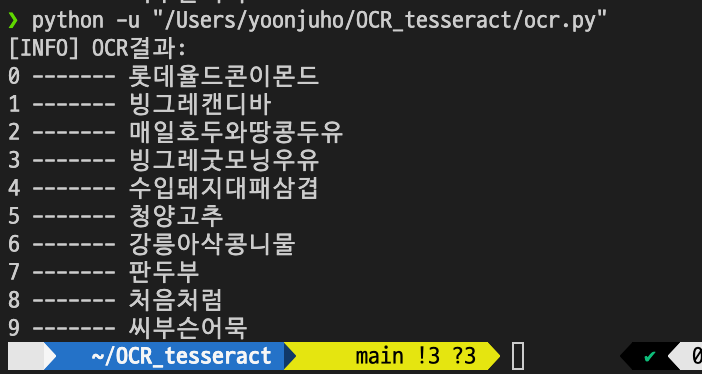

    
[reference](https://yunwoong.tistory.com/72?category=902345) 


